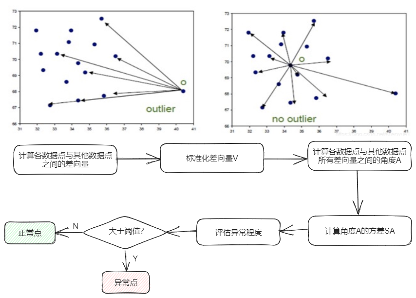

# ABOD

## 算法简介

高维度下距离同质化，角度比距离更稳定，因此基于角度的异常值检测(Angle-Based Outlier Detection, ABOD)关注了一组多变量特征空间中的任意三个数据点所形成的角度，而角度的围度对于离群点和正常点来说是不同的，由此对异常点进行检测

## 使用场景

适用于高维的多指标异常检测（指标数高于25），数据维度越高算法表现越好，指标数量少会导致算法准确率较低，同时该算法所耗费的时间成本较高。可以对所有的数据点进行异常度量 ，异常度量越高越有可能为异常值，阈值可根据实际情况调整

## 算法原理

该算法主要思路是通过比较数据点之间的差向量的角度来判断异常值，通过计算差向量的角度变化，算法可以捕捉到数据点与其他点之间的差异和偏移，进而识别出潜在的异常值。由于该算法不依赖于任何参数的选择，因此可以减少主观因素对异常检测结果的影响

* 论文原文链接: https://www.dbs.ifi.lmu.de/Publikationen/Papers/KDD2008.pdf