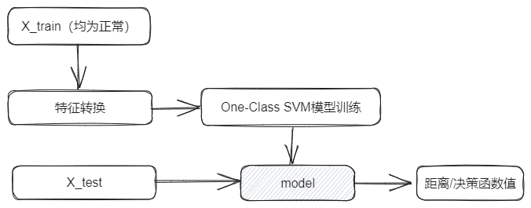

# One-Class SVM
## 算法简介

One-Class SVM是一种经典的无监督机器学习算法，在这种算法中，只有一个类别的训练数据，即正常样本，而没有异常样本。One-Class SVM的目标是学习一个超平面，将正样本从原点分离开，同时最大化超平面与原点之间的距离。与普通的二分类问题不同的是，One-Class SVM只有一个类，不属于该类全部判定为“异常”。

## 使用场景
适用于异常数据很少或完全没有、正常与异常样本在特征空间存在较大差距的异常检测。

## 算法原理
 

在算法的训练阶段，首先需要收集正常样本的数据，其中不包含异常样本，使用合适的核函数将数据映射到一个高维特征空间，并在高维特征空间中训练One-Class SVM模型，将正常样本从原点分开并最大化两者间隔。在预测阶段，对于每个新样本，利用训练好的模型计算样本到超平面的距离或决策函数的值，若距离或决策函数的值超过预先设定的阈值则将其归类为异常样本。

**论文原文链接**：<https://sci-hub.hkvisa.net/10.1162/089976601750264965>